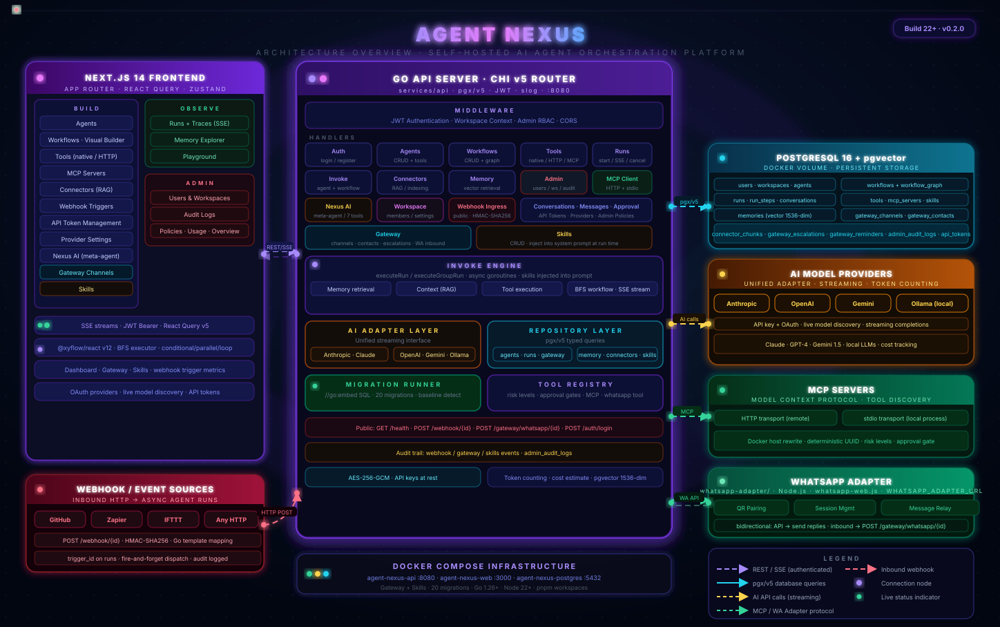

# Architecture — Agent Nexus

Agent Nexus is a developer-first AI agent control plane — not a chatbot wrapper. It gives you a self-hosted platform to create, run, and observe AI agents backed by any LLM.

Users can:
- Create agents backed by any LLM (Anthropic, OpenAI, Gemini, Ollama) using their own API keys
- Attach native tools (`native_read_file`, `native_write_file`, `native_web_search`, `native_http_request`, `whatsapp_request_owner_approval`, and agent self-management tools) with risk-based approval gates
- Connect MCP servers and expose discovered tools through the same approval pipeline
- Define HTTP tools that wrap external APIs with JSON schemas
- Index external context (files) via connectors
- Enable layered memory (conversation, agent, or workspace scope with pgvector similarity retrieval and agent-controlled review)
- Run single agents or pipeline/supervisor workflow graphs
- Invoke agents and workflows statelessly via the Invoke API (API token, no conversation required)
- Observe every run with full step-by-step traces — memory retrieved, context retrieved, model calls, tool calls, tokens, latency, cost estimate
- Administer the platform via an Admin Dashboard (users, workspaces, policies, audit logs, service log stream)
- Connect agents to inbound messaging channels (WhatsApp, HTTP) via the Nexus Gateway
- Define reusable Skills — named instruction modules injected into agent system prompts at run time
- Chat with Nexus AI, a built-in meta-agent for managing the entire platform in natural language

---

## System Diagram



---

## Technology Stack

| Layer | Choice |
|-------|--------|
| Backend | Go — `net/http` + chi router, no heavy frameworks |
| Database | PostgreSQL 16 + pgvector extension |
| Frontend | Next.js 14, TypeScript, Tailwind CSS, shadcn/ui |
| Auth | JWT access token (24h) + refresh token (httpOnly cookie, 30d); Google OAuth for providers |
| Encryption | AES-256-GCM for API keys and connector credentials at rest |
| Deployment | Docker Compose (Postgres + API + Web) |

---

## Monorepo Layout

```
agent-nexus/
  apps/
    web/                           ← Next.js 14 frontend (port 3000)
  services/
    api/                           ← Go API + agent runtime (port 8080)
      whatsapp-adapter/            ← Node.js adapter (whatsapp-web.js)
      cmd/catalog-ingest/          ← CLI: onboard repos into the pipeline repo catalog
    runner/                        ← repo-session runner: headless Claude Code sessions (port 8092)
  infra/
    docker-compose.yml
    migrations/                    ← numbered SQL files (001_init.sql …)
    scripts/setup_pipeline.sh      ← Jira→PR pipeline assembly (see docs/jira-pipeline.md)
  docs/jira-pipeline.md            ← autonomous Jira→PR pipeline architecture + setup
  ARCHITECTURE.md                  ← this file
  CONTRIBUTING.md
  LICENSE
```

---

## Go Package Layout

```
services/api/
  cmd/server/main.go               ← wires everything, starts HTTP server
  whatsapp-adapter/                ← Node.js adapter (whatsapp-web.js); QR pairing + message relay
  internal/
    api/
      handler/                     ← HTTP handlers, one file per domain group
        agents.go                  ← Agent CRUD, export/import, tool/connector/skill assignments
        api_tokens.go              ← Named API token management
        admin.go                   ← Admin user/workspace/usage/policy endpoints + service log stream
        approval.go                ← Tool approval gate (approve / reject / submit user input)
        audit.go                   ← Admin audit log queries
        auth.go                    ← Register, login, logout, refresh, /me, workspace switch
        compaction_runtime.go      ← Conversation compaction background task
        completion.go              ← Completion helpers shared across handlers
        config.go                  ← Public /api/v1/config endpoint (demo_mode flag, etc.)
        connectors.go              ← Connector CRUD, sync, documents, sync-jobs, filesystem browse
        conversations.go           ← Conversation CRUD + bulk delete
        gateway.go                 ← Gateway channels, sessions, events, contacts, escalations,
                                      reminders, scheduled messages, pairings, outbox;
                                      inbound WhatsApp + HTTP dispatch
        groups.go                  ← Workflow CRUD, graph save/load, workflow runs (WorkflowsHandler)
        handlers.go                ← Top-level Handlers struct wiring all sub-handlers
        invoke.go                  ← Stateless agent + workflow invoke (POST /invoke/agents/:id)
        mcp.go                     ← MCP server CRUD, sync, tool list, per-tool risk update
        memory.go                  ← Memory list, delete, bulk delete
        memory_runtime.go          ← Memory approve/reject (agent-controlled memory review)
        nexus_ai.go                ← Nexus AI meta-agent chat endpoint (13 tools)
        observability.go           ← Observability endpoints (latency distribution)
        provider_helper.go         ← Shared provider/model resolution helpers
        providers.go               ← Provider credential CRUD, model listing, Google OAuth flow
        runs.go                    ← Run CRUD, start (SSE), approve, cancel, user input, children
        runner_credentials.go      ← Workspace Claude account for repo sessions (setup-token)
        wait_state.go              ← Durable wait snapshots (run_wait_states persist/claim)
        session_wait.go            ← Session wait registry + runner completion callback
        resume.go                  ← Headless resume of parked runs (approval + session)
        mcp_executor.go            ← Executes tools-table entries of type 'mcp' via the MCP client
        mcp_oauth.go               ← OAuth 2.1 for remote MCP servers (start/callback, token refresh)
        skills.go                  ← Skill CRUD, per-agent skill list/set
        skills_helper.go           ← Shared skill injection helpers
        tools.go                   ← Tool CRUD
        tools_helper.go            ← Shared tool resolution helpers
        webhook_triggers.go        ← Webhook trigger CRUD + inbound receive
        whatsapp_creds.go          ← Internal credential persistence for WhatsApp adapter
        workspace.go               ← Workspace CRUD, member management
      middleware/                  ← JWT auth, API-token auth, RBAC, logging, CORS
      router/router.go             ← registers all routes on chi.Router
    domain/types.go                ← all Go types (single file)
    repository/                    ← pgx/v5 queries, one file per aggregate
      gateway.go                   ← gateway_channels, sessions, contacts, escalations, reminders,
                                      scheduled_messages
      skills.go                    ← skills table queries
    gateway/
      service.go                   ← inbound message dispatch, session matching, contact lookup
    runtime/
      agent/
        runner.go                  ← placeholder — the run loop lives in handler/runs.go + handler/invoke.go
        prompt.go                  ← system prompt assembly (skills, memory, context injection)
        stream.go                  ← SSE streaming helpers
      memory/
        engine.go                  ← retrieve + store + summarise
        vector.go                  ← pgvector similarity helpers
      context/
        retriever.go               ← query connector_chunks by embedding
      trace/
        logger.go                  ← writes RunStep records
      cost/                        ← per-model cost estimation
      logstream/                   ← admin service log stream relay
    provider/
      interface.go                 ← Provider interface
      router.go                    ← provider routing by credential ID
      tokens.go                    ← token counting helpers
      anthropic/ openai/ gemini/ ollama/
    tools/
      registry.go                  ← tool lookup by name
      executor.go                  ← risk check → approval gate → execute → trace
      http_executor.go             ← HTTP tool execution
      agents.go                    ← native_call_agent, native_create_agent
      code_tool.go                 ← code-type tool execution
      ephemeral.go                 ← ephemeral agent cleanup
      http_request.go              ← native_http_request
      http_tools_mgmt.go           ← native_create_http_tool
      list_tools.go                ← native_list_tools
      memory_tools.go              ← native_save_memory, native_delete_memory
      messaging.go                 ← whatsapp_send_message, whatsapp_create_reminder, etc.
      read_file.go                 ← native_read_file
      request_skill.go             ← native_request_skill
      request_tool.go              ← native_request_tool
      save_memory.go               ← memory save pipeline
      skills_mgmt.go               ← native_create_skill
      tools_mgmt.go                ← tool management helpers
      web_search.go                ← native_web_search
      whatsapp.go                  ← whatsapp_request_owner_approval
      workflows_mgmt.go            ← workflow invocation from native tools
      write_file.go                ← native_write_file
    mcp/client.go                  ← connect, list tools, proxy calls
    connector/pipeline.go          ← fetch → chunk → embed → upsert
    auth/                          ← JWT, RBAC, bcrypt
    config/config.go               ← env-based config (WHATSAPP_ADAPTER_URL, PUBLIC_APP_URL, etc.)
  pkg/
    encrypt/aes.go                 ← AES-256-GCM helpers
    paginate/cursor.go
    errs/errors.go                 ← typed API error helpers
```

---

## Domain Model

### User & Workspace
```go
type User struct {
    ID        string
    Email     string
    FullName  string
    AvatarURL string
    IsActive  bool
    IsAdmin   bool
    CreatedAt time.Time
    UpdatedAt time.Time
}

type Workspace struct {
    ID            string
    Name          string
    DisplayName   string
    OwnerID       string
    WorkspaceType string    // personal | team | organization | project | sandbox
    Settings      JSONB
    CreatedAt     time.Time
    UpdatedAt     time.Time
}
```

### Agent
```go
type Agent struct {
    ID                       string
    WorkspaceID              string
    Name                     string
    Description              string
    Instructions             string    // system prompt
    Provider                 string    // anthropic | openai | gemini | ollama
    Model                    string
    Temperature              float64
    MaxTokens                int
    MemoryEnabled            bool
    MemoryScope              string    // conversation | agent | workspace
    MemorySaveMode           string    // automatic | agent_controlled
    MemoryReviewPolicy       string    // none | agent_review
    MaxMemories              int
    MinRelevanceScore        float64
    MemoryMinImportance      float64
    MemoryDedupeThreshold    float64
    ContextRetrievalEnabled  bool
    MaxSteps                 int
    MaxToolCalls             int
    MaxDurationSecs          int
    MaxHistoryMessages       int       // 0 = default (20)
    LazyToolLoading          bool
    CompactionThreshold      int       // 0 = default (6 messages)
    CompactionTokenThreshold int       // 0 = default (3000 input tokens)
    Status                   string    // active | paused | archived
    CreatedBy                string
    CreatedAt                time.Time
    UpdatedAt                time.Time
}
```

### Run
```go
type Run struct {
    ID                string
    WorkspaceID       string
    AgentID           string
    ConversationID    string
    UserID            string
    Input             string
    Output            string
    Status            RunStatus    // pending | running | success | failed | cancelled | approval_wait
    StartedAt         time.Time
    CompletedAt       *time.Time
    TotalInputTokens  int
    TotalOutputTokens int
    CostEstimate      float64
    ErrorMessage      string
    TriggerID         string    // set when fired by a webhook trigger
    ParentRunID       string    // set for sub-agent and workflow node runs
    WorkflowNodeID    string    // set for workflow node runs
    TraceID           string    // shared across all runs in a workflow execution
    ChannelSessionID  string    // set for gateway-originated runs
}

type RunStep struct {
    ID         string
    RunID      string
    StepType   StepType    // memory_retrieval | context_retrieval | model_call | tool_call |
                           // mcp_call | approval_wait | final_response | error
    Input      JSONB
    Output     JSONB
    LatencyMs  int
    TokensUsed int
    ToolName   string
    Error      string
    CreatedAt  time.Time
}
```

### Tool
```go
type Tool struct {
    ID               string
    WorkspaceID      string
    Name             string
    Description      string
    Type             string          // native | mcp | http | code
    InputSchema      JSONB
    OutputSchema     JSONB
    Config           JSONB           // HTTP tool runtime config (URL, headers, method, etc.)
    RiskLevel        string          // low | medium | high | critical
    RequiresApproval bool
    TimeoutMs        int
    Enabled          bool
    CreatedAt        time.Time
    UpdatedAt        time.Time
}
```

### Memory
```go
type Memory struct {
    ID              string
    WorkspaceID     string
    AgentID         string
    UserID          string
    ConversationID  string
    Scope           MemoryScope    // conversation | agent | workspace
    Content         string
    RelevanceScore  float64
    ImportanceScore float64
    Status          string         // active | pending_review | rejected
    SaveSource      string         // automatic | agent_controlled
    SourceRunID     string
    Metadata        JSONB
    CreatedAt       time.Time
    UpdatedAt       time.Time
}
```

### Skill
```go
type Skill struct {
    ID                string
    WorkspaceID       *string    // nil = platform-managed (protected)
    Name              string
    Description       string
    Content           string     // injected as a labelled block in the agent system prompt
    Source            string     // managed | custom
    Enabled           bool
    RequiredToolNames []string   // tools auto-attached when this skill is enabled
    CreatedBy         *string
    CreatedAt         time.Time
    UpdatedAt         time.Time
}
```

### GatewayChannel
```go
type GatewayChannel struct {
    ID          string
    WorkspaceID string
    AgentID     string
    Name        string
    Description string
    ChannelType string    // whatsapp | http
    Config      JSONB     // GatewayChannelConfig JSON
    IsActive    bool
    CreatedBy   string
    CreatedAt   time.Time
    UpdatedAt   time.Time
}

type GatewayChannelConfig struct {
    AccountID            string
    AdapterURL           string    // whatsapp only
    DMPolicy             string
    AllowFrom            []string
    SessionScope         string
    GroupPolicy          string
    HistoryLimit         int
    SelfChatEnabled      bool
    AssistantEnabled     bool
    BotModeEnabled       bool
    ChatApprovalsEnabled bool
}
```

### GatewayContact
```go
type GatewayContact struct {
    ID               string
    WorkspaceID      string
    ChannelID        string
    AccountID        string
    DisplayName      string
    Alias            string
    PhoneNumber      string
    WhatsAppJID      string     // WhatsApp JID (e.g. 919876543210@c.us)
    Role             string     // owner | trusted | blocked
    AgentID          *string    // optional per-contact agent override
    AutoReplyEnabled bool
    LastMatchedAt    *time.Time
    CreatedAt        time.Time
    UpdatedAt        time.Time
}
```

### ScheduledMessage
```go
type ScheduledMessage struct {
    ID              string
    WorkspaceID     string
    ChannelID       string
    ContactID       string
    AccountID       string
    PeerKind        string
    PeerID          string
    Message         string
    SendAt          time.Time
    Status          string          // pending | sent | failed | cancelled
    RecurrenceRule  JSONB
    OccurrenceCount int
    LastError       string
    CreatedBy       string
    CreatedAt       time.Time
    UpdatedAt       time.Time
}
```

### WebhookTrigger
```go
type WebhookTrigger struct {
    ID              string
    WorkspaceID     string
    Name            string
    Description     string
    TargetType      string     // agent | workflow
    TargetID        string
    InputTemplate   string     // Go text/template applied to inbound payload
    Secret          string     // HMAC-SHA256 shared secret (optional)
    IsActive        bool
    CreatedBy       string
    CreatedAt       time.Time
    UpdatedAt       time.Time
    LastTriggeredAt *time.Time
    TriggerCount    int64
}
```

---

## Provider Interface

All LLM adapters implement the same interface (`internal/provider/interface.go`), normalising provider-specific wire formats internally:

```go
type Provider interface {
    Complete(ctx context.Context, req CompletionRequest) (<-chan CompletionEvent, error)
    Embed(ctx context.Context, text string) ([]float32, error)
    Models() []ModelInfo
}

type CompletionRequest struct {
    Model       string
    Messages    []Message
    Tools       []ToolDefinition
    Temperature float64
    MaxTokens   int
    Stream      bool
}

type CompletionEvent struct {
    Type     string    // delta | tool_call | done | error
    Delta    string
    ToolCall *ToolCall
    Usage    *Usage
    Error    error
}
```

---

## Agent Run Loop

The loop lives in `internal/api/handler` — `runs.go` (`Start`, playground SSE
runs) and `invoke.go` (`executeRun`, the general engine used by the Invoke API,
webhooks, the gateway, and sub-agent calls). `runtime/agent/runner.go` is a
placeholder; do not make run-loop changes there.

1. Load agent config + tool list from DB (`LazyToolLoading` defers tool schema resolution to first tool call)
2. Load agent's attached Skills from DB; append each skill's `content` as a labelled block in the system prompt; auto-attach any `required_tool_names` declared by the skill
3. Create `Run` record (`status=running`)
4. Retrieve relevant memories — vector similarity search on the user message embedding → log `RunStep{type: memory_retrieval}`
5. Retrieve relevant context chunks — pgvector search across `connector_chunks` filtered by agent's allowed connectors → log `RunStep{type: context_retrieval}`
6. Build the messages slice: system prompt + memory summaries + context chunks + conversation history (token-budget trimmed, max `MaxHistoryMessages`) + user message
7. Call `provider.Complete()` → stream `CompletionEvent`s → log `RunStep{type: model_call}` → emit SSE deltas to client
8. On `tool_call` event:
   - Look up tool in registry (native, MCP, HTTP, code)
   - If `requires_approval`: update run to `approval_wait`, emit `approval_required` SSE, block until decision arrives
   - Execute tool with timeout → log `RunStep{type: tool_call}` → append result message → loop back to step 7
   - Sub-agent calls (`native_call_agent`) fan out to child runs sharing the same `trace_id`; parallel calls execute concurrently; depth is capped at 3
   - `native_launch_repo_session` blocks on an external coding session (`session_wait`) and resumes on the runner's completion callback
9. Emit `run_completed` SSE
10. Update `Run` record (`status=success`, token counts, cost estimate)
11. Async: summarise run, store new `Memory` records with embeddings; if conversation exceeds `CompactionThreshold` messages or `CompactionTokenThreshold` input tokens, run compaction to produce a rolling LLM-generated summary

### Durable Waits (approval + session)

Top-level runs blocked at an approval gate or inside `native_launch_repo_session`
snapshot their loop state (messages, pending tool-call batch and index, counters)
to `run_wait_states` before blocking. After a short in-process wait the goroutine
*parks* — exits, leaving the run in `approval_wait`/`session_wait`. The approval
decision (`POST /runs/{id}/approve`) or the runner's completion callback
(`POST /internal/sessions/callback`) atomically claims the snapshot and re-enters
the loop headlessly at the exact pending call — so these waits survive process
restarts (the startup sweep only fails waiting runs *without* a snapshot).
Nested sub-runs and workflow-node runs are excluded: their parent's stack cannot
be restored. See `handler/wait_state.go`, `session_wait.go`, `resume.go`, and
docs/jira-pipeline.md.

### Memory Review Policy

When `MemoryReviewPolicy = "agent_review"`, memories created during a run are stored with `status = "pending_review"`. The agent can call `native_list_memories`, `native_approve_memory`, or `native_reject_memory` to manage them. Memories with `status = "pending_review"` are not used in retrieval until approved.

---

## Invoke API

`POST /api/v1/invoke/agents/{agentId}` and `POST /api/v1/invoke/workflows/{workflowId}` provide stateless execution — no conversation is needed. Both endpoints are authenticated via API token or JWT.

Request:
```json
{ "input": "Summarise this document...", "session_id": "optional-session-key" }
```

Response (streamed SSE, same event types as the conversation run endpoint):
```
data: {"type":"run_started","run_id":"..."}
data: {"type":"delta","content":"..."}
data: {"type":"run_completed","run_id":"...","usage":{...},"cost":0.004}
```

The invoke path uses the same `ExecutionContext` and run loop as playground runs; runs appear in the Runs view with the same trace detail.

---

## MCP Client

- Connects to MCP servers via HTTP+SSE or stdio transport
- Calls `tools/list` on connect, stores results in `mcp_tools` table (prefixed `mcp_`)
- All MCP tool calls during agent runs go through `tools/executor.go` — same risk-check and approval-gate path as native tools; never called directly
- Per-tool risk level editable via `PATCH /api/v1/mcp-servers/:id/tools/:toolId`
- Server credentials stored AES-256-GCM encrypted in `mcp_servers.config`

---

## Nexus Gateway

`internal/gateway/service.go` — `Dispatch(ctx, channelID, senderID, body)`:

1. Load channel + account from DB; verify channel is active
2. Look up contact by `whatsapp_jid` (or sender ID for HTTP channels)
3. If contact role is `blocked` → drop message silently
4. Check `auto_reply_enabled` for the contact; if false → skip agent invocation
5. Match or create a `channel_session` for the (channel, sender) pair
6. Look up the session's `conversation_id`; create one if this is a new session
7. Determine effective agent: contact-level override → channel default agent
8. Invoke the agent run via `executeRun` (same path as playground runs); run carries `ChannelSessionID`
9. Send the agent's output back to the sender via the appropriate adapter
10. Log the inbound event to `gateway_events`

### WhatsApp Adapter (`whatsapp-adapter/`)
- Node.js service using `whatsapp-web.js`; exposes a REST API consumed by the Go API
- `GET  /status/:channelId` — connection status
- `POST /login/start/:channelId` — initialise pairing; returns QR code data
- `GET  /login/qr/:channelId` — QR image for scanning
- `POST /logout/:channelId` — disconnect session
- `POST /send` — send a text message to a JID
- On inbound message: POSTs to `GATEWAY_API_URL/gateway/whatsapp/{channelId}`
- Auth data persisted at `WHATSAPP_AUTH_ROOT` (mounted as a Docker volume)
- WhatsApp credentials encrypted and stored via the internal `/internal/whatsapp/{accountId}/credentials` API (no JWT — adapter-only)

### HTTP Channel
- `POST /gateway/http/{channelId}` — accepts `{"input": "...", "session_id": "..."}` → 202 `{run_id, session_id, conversation_id, status}`
- Session key format: `agent:{agentID}:http:{accountID}:user:{sessionID}`
- No external adapter required; Go API handles dispatch directly

### Escalation / Approval Flow
1. During a run, agent calls `whatsapp_request_owner_approval(reason, details)`
2. Native tool creates a `gateway_escalation` record with a random approval code
3. Notifies all `owner`-role contacts for the channel via WhatsApp message
4. Run blocks waiting for resolution (polls escalation status)
5. Owner replies in WhatsApp with `approve CODE` or `reject CODE`
6. Adapter receives reply → Gateway handler matches code → updates escalation status → run unblocks
7. Owners can also send `disable approvals` / `enable approvals` to toggle `auto_reply_enabled`

### Scheduled Messages
- Created via `POST /api/v1/gateway/scheduled-messages` or by agent tools (`whatsapp_create_reminder`)
- Stored in `gateway_scheduled_messages` table with `send_at` timestamp and optional recurrence rule
- Background job fires messages at the scheduled time via the appropriate channel adapter
- Full CRUD: list, get, delete; list is filterable by channel and contact

---

## Connector Pipeline

`connector/pipeline.go` — `Sync(ctx, connectorID)`:

1. Load connector + credentials from DB
2. Fetch documents from provider (filesystem)
3. For each document: hash content (skip if unchanged) → chunk (512 tokens, 64-token overlap) → embed via `provider.Embed()` → upsert into `connector_chunks`
4. Write `ConnectorSyncJob` record

During agent runs, context retrieval queries `connector_chunks` ordered by `embedding <=> query_embedding` (pgvector cosine distance), filtered to the agent's allowed connector list.

`GET /api/v1/filesystem/browse` — authenticated endpoint for exploring the local filesystem when setting up a filesystem connector.

---

## SSE Stream Events

`POST /api/v1/conversations/:id/runs` returns a Server-Sent Events stream:

```
data: {"type":"run_started","run_id":"..."}
data: {"type":"step_completed","step":{"type":"memory_retrieval","latency_ms":38}}
data: {"type":"step_completed","step":{"type":"context_retrieval","chunks":3}}
data: {"type":"step_completed","step":{"type":"model_call","input_tokens":3210}}
data: {"type":"delta","content":"The answer is..."}
data: {"type":"tool_call","tool":"native_read_file","input":{"path":"readme.md"}}
data: {"type":"step_completed","step":{"type":"tool_call","tool":"native_read_file","latency_ms":14}}
data: {"type":"approval_required","tool":"native_write_file","input":{...},"approval_id":"..."}
data: {"type":"run_completed","run_id":"...","usage":{"input":5210,"output":580},"cost":0.012}
data: {"type":"error","message":"..."}
```

The same event format is emitted by the Invoke API endpoints (`/api/v1/invoke/agents/:id` and `/api/v1/invoke/workflows/:id`).

---

## Database Schema

Full schema: `infra/migrations/001_init.sql`

Key tables:

| Table | Purpose |
|-------|---------|
| `users`, `workspaces`, `roles`, `user_roles` | Auth and multi-tenancy |
| `provider_credentials` | Encrypted API keys, one per provider per workspace; OAuth token columns |
| `oauth_states` | Short-lived state tokens for OAuth flows |
| `agents` | Agent configuration (all fields including compaction thresholds, memory policy) |
| `tools`, `agent_tools` | Tool registry + per-agent assignments |
| `skills`, `agent_skills` | Reusable instruction modules; per-agent attachments with order_index |
| `mcp_servers`, `mcp_tools` | MCP server registry + discovered tools |
| `conversations`, `messages` | Chat history; conversation carries `compaction` JSON summary |
| `runs`, `run_steps` | Execution records + trace steps; runs carry `parent_run_id`, `trace_id`, `workflow_node_id`, `channel_session_id` |
| `webhook_triggers` | Persistent inbound HTTP endpoints; each tied to an agent or workflow |
| `memories` | Vector memory (pgvector embedding column); carries `status`, `importance_score`, `save_source` |
| `connectors`, `connector_documents`, `connector_chunks` | Indexed external context |
| `context_retrieval_logs` | Which chunks were used in which run |
| `api_tokens` | Named workspace API tokens with optional expiry |
| `gateway_channels` | Messaging channel config (WhatsApp or HTTP); linked to an agent |
| `gateway_channel_accounts` | Per-channel adapter connection state (status, self_id, last_error) |
| `channel_sessions` | Active conversations per (channel, sender); maps to a `conversation_id` |
| `gateway_contacts` | Known senders with roles (`owner`, `trusted`, `blocked`) and per-contact agent overrides |
| `gateway_escalations` | Approval requests created by `whatsapp_request_owner_approval` |
| `gateway_reminders` | Scheduled outbound messages to contacts (legacy; superseded by scheduled_messages) |
| `gateway_scheduled_messages` | Full scheduled message objects with recurrence, status, error tracking |
| `gateway_events` | Inbound message log per channel |
| `gateway_pairing_requests` | Peer pairing codes (approve/reject flow) |
| `gateway_outbound_messages` | Outbound message delivery log with retry tracking |
| `admin_audit_logs`, `policies` | Governance |

---

## REST API Surface

```
# Health
GET    /health

# Public config (no auth)
GET    /api/v1/config                               ← demo_mode flag, feature flags

# Auth
POST   /api/v1/auth/register
POST   /api/v1/auth/login
POST   /api/v1/auth/refresh
POST   /api/v1/auth/logout                          ← authenticated
GET    /api/v1/auth/me                              ← authenticated
POST   /api/v1/workspaces/switch                    ← switch active workspace

# Workspace
GET    /api/v1/workspace                            ← current workspace
PATCH  /api/v1/workspace
GET    /api/v1/workspace/members
POST   /api/v1/workspace/members
PATCH  /api/v1/workspace/members/{id}
DELETE /api/v1/workspace/members/{id}

# Workspaces (user's full list)
GET    /api/v1/workspaces
POST   /api/v1/workspaces
DELETE /api/v1/workspaces/{id}

# API Tokens
GET    /api/v1/api-tokens
POST   /api/v1/api-tokens
DELETE /api/v1/api-tokens/{id}

# Providers
GET    /api/v1/providers
POST   /api/v1/providers
PUT    /api/v1/providers/{id}
DELETE /api/v1/providers/{id}
GET    /api/v1/providers/{id}/models
GET    /api/v1/providers/oauth/google/authorize     ← initiates Google OAuth
GET    /api/v1/providers/oauth/google/callback      ← public; Google redirect target

# Agents
GET    /api/v1/agents
POST   /api/v1/agents
POST   /api/v1/agents/import                        ← import from exported JSON
GET    /api/v1/agents/{id}
PUT    /api/v1/agents/{id}
DELETE /api/v1/agents/{id}
GET    /api/v1/agents/{id}/export                   ← export as portable JSON
GET    /api/v1/agents/{id}/tools
PUT    /api/v1/agents/{id}/tools
GET    /api/v1/agents/{id}/connectors
PUT    /api/v1/agents/{id}/connectors
GET    /api/v1/agents/{id}/skills
PUT    /api/v1/agents/{id}/skills

# Invoke (stateless; API token or JWT)
POST   /api/v1/invoke/agents/{agentId}              ← SSE stream
POST   /api/v1/invoke/workflows/{workflowId}        ← SSE stream

# Tools
GET    /api/v1/tools
POST   /api/v1/tools
GET    /api/v1/tools/{id}
PUT    /api/v1/tools/{id}
DELETE /api/v1/tools/{id}

# MCP Servers
GET    /api/v1/mcp-servers
POST   /api/v1/mcp-servers
GET    /api/v1/mcp-servers/{id}
DELETE /api/v1/mcp-servers/{id}
POST   /api/v1/mcp-servers/{id}/sync
GET    /api/v1/mcp-servers/{id}/tools
PATCH  /api/v1/mcp-servers/{id}/tools/{toolId}     ← update per-tool risk level

# Connectors
GET    /api/v1/connectors
POST   /api/v1/connectors
GET    /api/v1/connectors/{id}
DELETE /api/v1/connectors/{id}
POST   /api/v1/connectors/{id}/sync
GET    /api/v1/connectors/{id}/documents
GET    /api/v1/connectors/{id}/sync-jobs
GET    /api/v1/filesystem/browse                    ← browse local filesystem

# Conversations & Runs
GET    /api/v1/conversations
POST   /api/v1/conversations
DELETE /api/v1/conversations                        ← delete all conversations
GET    /api/v1/conversations/{id}
DELETE /api/v1/conversations/{id}
POST   /api/v1/conversations/{id}/runs              ← starts run, returns SSE stream
GET    /api/v1/conversations/{id}/runs
GET    /api/v1/runs
GET    /api/v1/runs/stats                           ← aggregate stats (token/cost by period)
GET    /api/v1/runs/{id}
GET    /api/v1/runs/{id}/children                   ← sub-agent + workflow node child runs
POST   /api/v1/runs/{id}/approve                    ← approve pending tool call
POST   /api/v1/runs/{id}/input                      ← submit user input to a waiting run
POST   /api/v1/runs/{id}/cancel

# Memory
GET    /api/v1/memory
PATCH  /api/v1/memory/{id}/approve                 ← approve pending_review memory
PATCH  /api/v1/memory/{id}/reject                  ← reject pending_review memory
DELETE /api/v1/memory/{id}
DELETE /api/v1/memory                              ← bulk delete

# Workflows (visual workflow graphs; previously agent-groups)
GET    /api/v1/workflows
POST   /api/v1/workflows
GET    /api/v1/workflows/{id}
PUT    /api/v1/workflows/{id}
DELETE /api/v1/workflows/{id}
POST   /api/v1/workflows/{id}/runs
GET    /api/v1/workflows/{id}/graph
PUT    /api/v1/workflows/{id}/graph

# Webhook Triggers (authenticated CRUD)
GET    /api/v1/webhook-triggers
POST   /api/v1/webhook-triggers
GET    /api/v1/webhook-triggers/{id}
PUT    /api/v1/webhook-triggers/{id}
DELETE /api/v1/webhook-triggers/{id}

# Webhook Inbound (public — no auth)
POST   /webhook/{webhookId}                         ← fires a run; verifies HMAC-SHA256 if secret set

# Gateway (authenticated)
GET    /api/v1/gateway/channels
POST   /api/v1/gateway/channels
GET    /api/v1/gateway/channels/{id}
PUT    /api/v1/gateway/channels/{id}
DELETE /api/v1/gateway/channels/{id}
GET    /api/v1/gateway/channels/{id}/adapter/status
POST   /api/v1/gateway/channels/{id}/adapter/login/start
GET    /api/v1/gateway/channels/{id}/adapter/login/qr
POST   /api/v1/gateway/channels/{id}/adapter/logout
GET    /api/v1/gateway/sessions
DELETE /api/v1/gateway/sessions/{id}
GET    /api/v1/gateway/events
GET    /api/v1/gateway/pairings
POST   /api/v1/gateway/pairings/{id}/approve
POST   /api/v1/gateway/pairings/{id}/reject
GET    /api/v1/gateway/outbox
GET    /api/v1/gateway/reminders
GET    /api/v1/gateway/scheduled-messages
POST   /api/v1/gateway/scheduled-messages
GET    /api/v1/gateway/scheduled-messages/{id}
DELETE /api/v1/gateway/scheduled-messages/{id}
GET    /api/v1/gateway/escalations
POST   /api/v1/gateway/escalations/{id}/approve
POST   /api/v1/gateway/escalations/{id}/reject
GET    /api/v1/gateway/contacts
POST   /api/v1/gateway/contacts
PUT    /api/v1/gateway/contacts/{id}
DELETE /api/v1/gateway/contacts/{id}

# Gateway Inbound (public — called by channel adapters)
POST   /gateway/whatsapp/{channelId}                ← inbound WhatsApp messages from adapter
POST   /gateway/http/{channelId}                    ← inbound HTTP channel messages

# Skills (authenticated)
GET    /api/v1/skills
POST   /api/v1/skills
GET    /api/v1/skills/{id}
PUT    /api/v1/skills/{id}
DELETE /api/v1/skills/{id}

# Observability
GET    /api/v1/observability/latency

# Nexus AI meta-agent
POST   /api/v1/nexus-ai/chat

# Admin (requires is_admin flag)
GET    /api/v1/admin/users
GET    /api/v1/admin/users/{id}
PATCH  /api/v1/admin/users/{id}
GET    /api/v1/admin/workspaces
PATCH  /api/v1/admin/workspaces/{id}
GET    /api/v1/admin/audit-logs
GET    /api/v1/admin/service-logs/stream            ← SSE stream of API server logs
POST   /internal/service-logs/ingest               ← internal log ingestion (token-protected)
GET    /api/v1/admin/usage
GET    /api/v1/admin/policies
PUT    /api/v1/admin/policies

# Internal (no JWT — adapter / process only)
GET    /internal/whatsapp/{accountId}/credentials
PUT    /internal/whatsapp/{accountId}/credentials
DELETE /internal/whatsapp/{accountId}/credentials
```

---

## Frontend Route Map

```
/                         → /dashboard
/login                    public
/dashboard                overview metrics + recent runs
/agents                   agent list
/agents/new               create agent (tabbed form)
/agents/[agentId]/edit    edit agent
/playground               new conversation picker
/playground/[id]          chat + live SSE trace panel
/conversations            conversation history browser
/runs                     runs table with filters
/runs/[runId]             run trace detail
/traces                   trace explorer
/traces/[traceId]         trace detail (alternate entry from runs)
/memory                   memory browser (approve / reject pending memories)
/usage                    token / cost dashboard
/tools                    tool registry
/mcp-servers              MCP servers + discovered tools
/connectors               connector list + sync management
/workflows                workflow list
/workflows/new            create workflow
/workflows/[workflowId]   visual canvas editor
/gateway                  gateway overview
/gateway/channels         channel list
/gateway/channels/new     create channel
/gateway/channels/[id]    channel detail (status, QR, contacts, sessions, escalations,
                          scheduled messages, reminders, pairings, events)
/triggers                 webhook trigger list
/triggers/new             create trigger
/triggers/[triggerId]     edit trigger
/skills                   skills list (managed + custom)
/skills/new               create skill
/nexus-ai                 Nexus AI meta-agent chat
/observability            latency distribution charts
/settings/providers       API key management
/settings/api-tokens      API token management
/settings/workspace       workspace settings + members
/settings/workspace/new   create new workspace
/docs                     built-in documentation index
/docs/what-is-an-agent
/docs/agent-configuration
/docs/invoke-api
/docs/sse-events
/docs/run-states
/docs/mcp-servers
/docs/workflows
/docs/what-is-a-tool
/docs/what-is-a-connector
/docs/what-is-an-agent-group
/docs/gateway
/docs/skills
/docs/api-tokens
/docs/architecture
/architecture             interactive architecture diagram viewer
/admin/overview
/admin/users
/admin/workspaces
/admin/policies
/admin/audit-logs
/admin/service-logs       live API server log stream
```
