# Agent Nexus


> Self-hosted, model-agnostic AI agent orchestration platform.

**[Try the live demo →](https://web-production-ae380.up.railway.app)** — Sign up and explore instantly. MCP servers, connectors, and API tokens are restricted in demo mode; self-host for full access.
Or use creds
Email: demo@demo.com
Password: Demo@123

Create AI agents backed by any LLM (Anthropic, OpenAI, Gemini, Ollama), attach tools, connect memory, and observe every run with full trace logging — all from your own infrastructure. No vendor lock-in, no data leaving your servers.

---

## Screenshots

<table>
<tr>
<td width="50%">

**Dashboard**
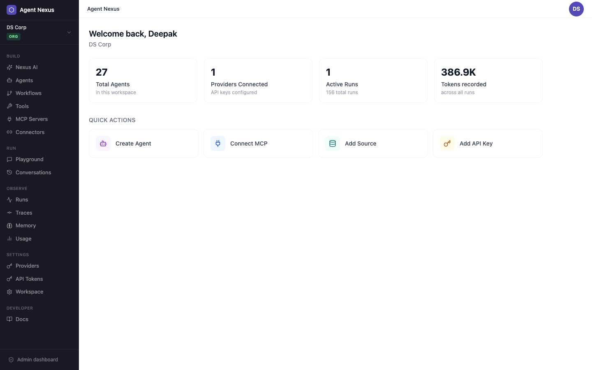

</td>
<td width="50%">

**Agent List**
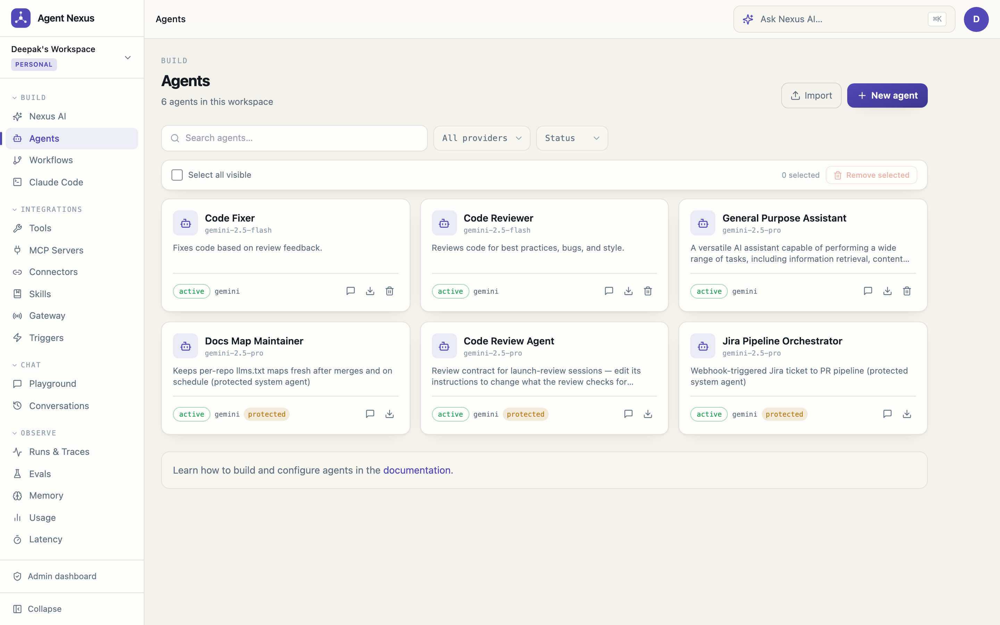

</td>
</tr>
<tr>
<td width="50%">

**Agent Builder — Tools (grouped by source)**
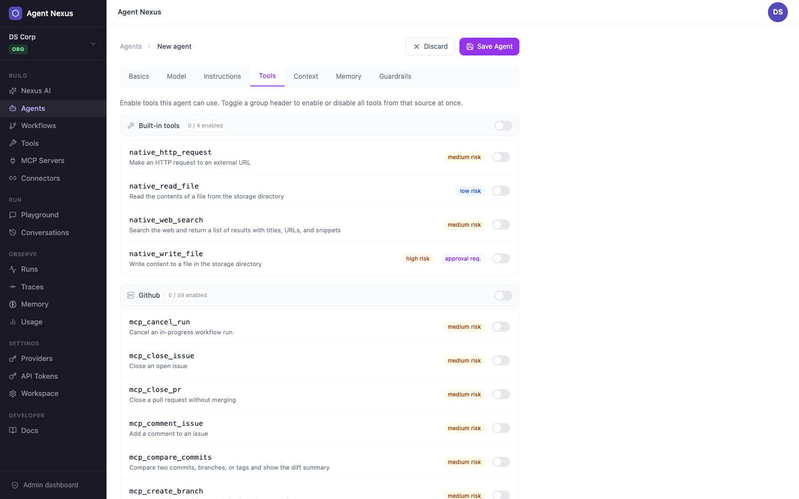

</td>
<td width="50%">

**Playground with Live Trace Panel**
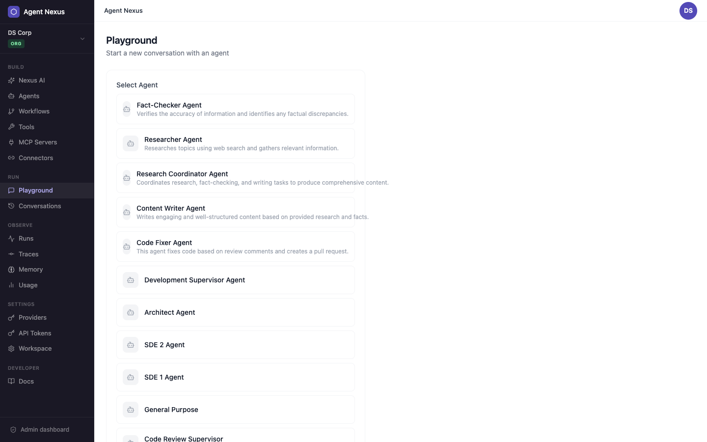

</td>
</tr>
<tr>
<td width="50%">

**Visual Workflow Canvas (Supervisor)**
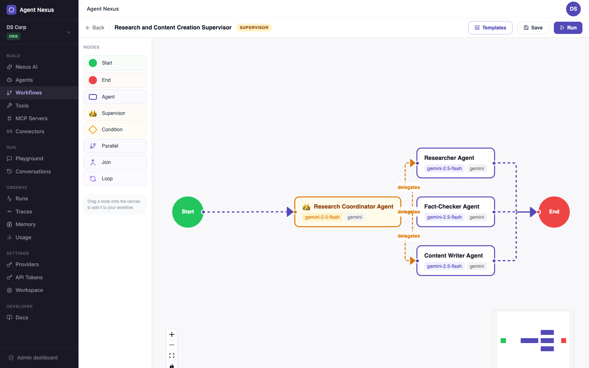

</td>
<td width="50%">

**Hierarchical Multi-Agent Workflow**
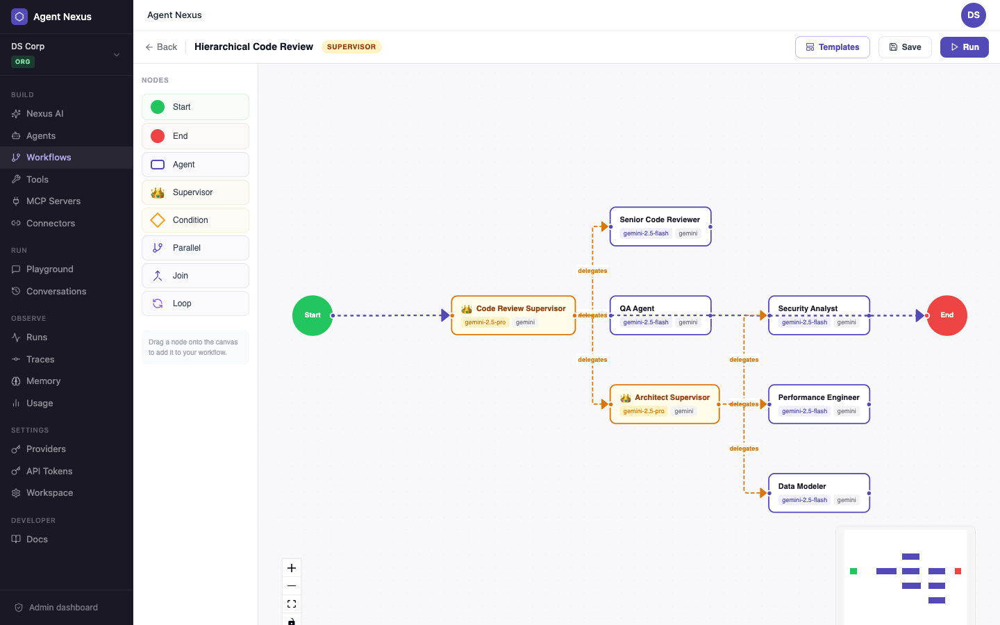

</td>
</tr>
<tr>
<td width="50%">

**Run Traces — Full Step Observability**
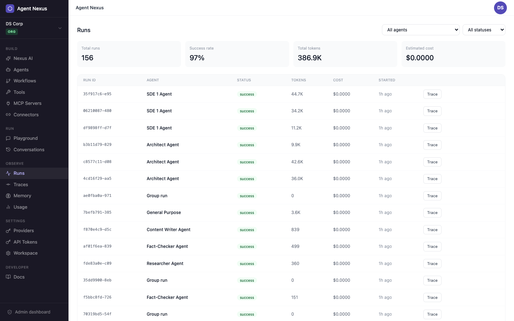

</td>
<td width="50%">

**MCP Server Integration**
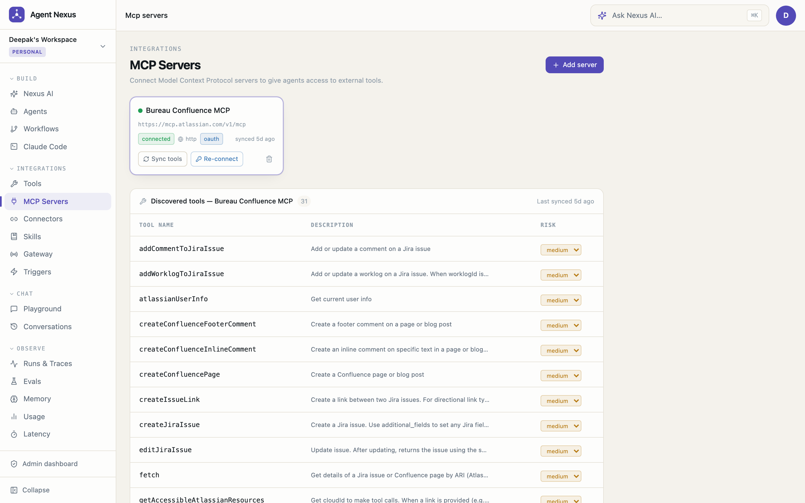

</td>
</tr>
<tr>
<td width="50%">

**Nexus AI — Meta-Agent Chat Interface**
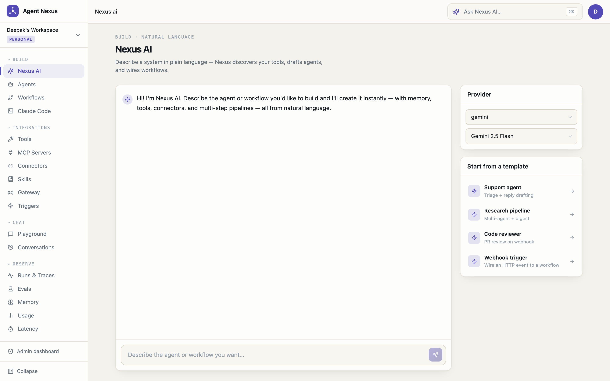

</td>
<td width="50%">

**Tools Registry (grouped by source)**
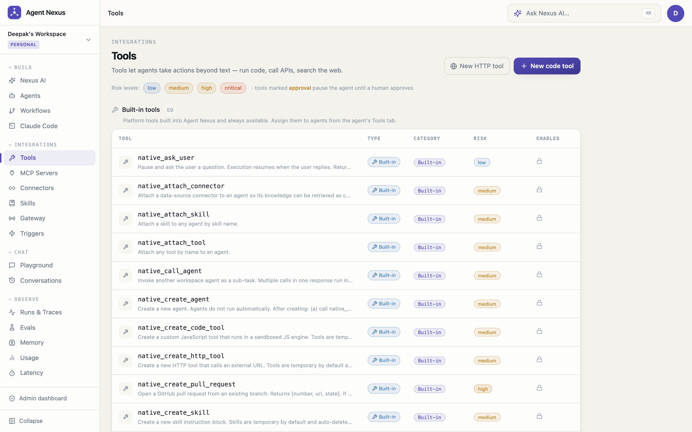

</td>
</tr>
<tr>
<td width="50%">

**Webhook Triggers — Inbound HTTP Endpoints**
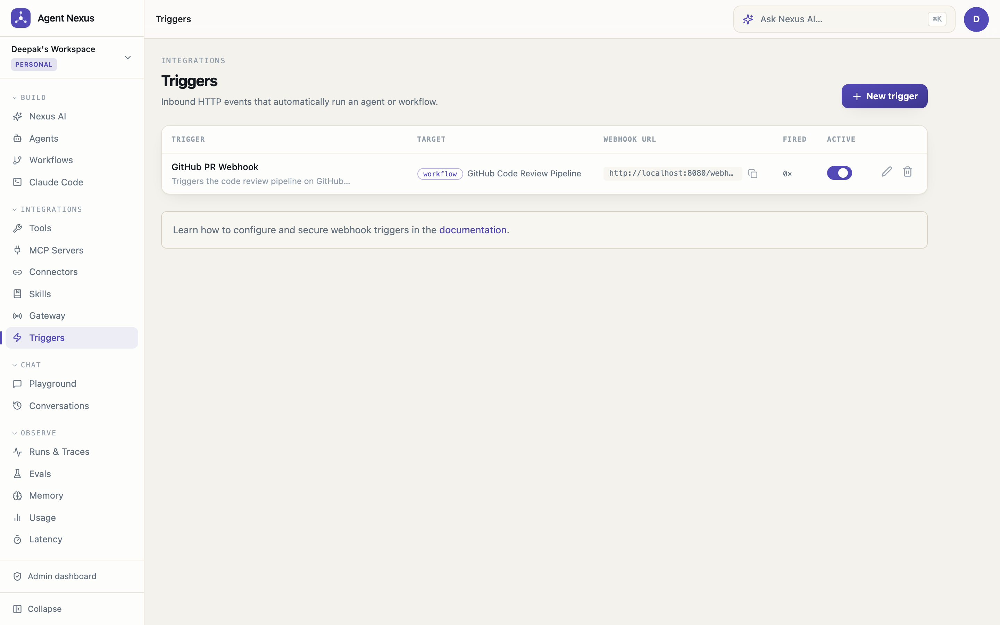

</td>
<td width="50%">

**Workflow Studio — Triggers Panel**
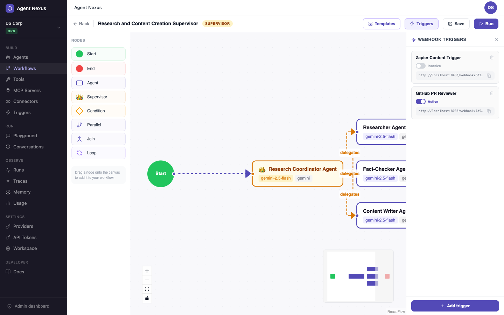

</td>
</tr>
</table>

---

## Features

### Core Agent Platform
- **Model-agnostic** — Anthropic Claude, OpenAI GPT, Google Gemini, and local Ollama models. Bring your own API keys per workspace. Switch providers without changing your agent config.
- **Agent builder** — configure instructions (system prompt), model, temperature, max tokens, memory scope, tool list, and guardrails (max steps, max tool calls, timeout) from a clean tabbed UI; tools are grouped by source (native, MCP, HTTP, code) with live search and collapsible sections; skills support drag-to-reorder
- **Agent export / import** — download any agent as a portable JSON file (tools referenced by name, not ID); import on any workspace or instance to recreate the agent in one click
- **Playground** — send messages and watch the agent think in real time via a live SSE trace panel showing every memory retrieval, tool call, model call, latency, and token count
- **Conversations history** — every playground session is saved; browse and replay past conversations from the Conversations page
- **Conversation compaction** — long conversations are automatically compressed into a rolling LLM-generated summary after a configurable message or token threshold; only the last 4 turns are replayed verbatim, drastically reducing input token cost on extended sessions; runs asynchronously after each reply with a subtle "Compacting…" indicator in the playground; threshold is configurable per agent (default: 6 messages or 3,000 input tokens)

### Multi-Agent Workflows
- **Visual canvas editor** — drag-and-drop workflow builder powered by React Flow; add agent nodes, condition branches, parallel fans, join gates, and loop nodes
- **Pipeline mode** — agents execute in sequence, each receiving the previous agent's output
- **Supervisor mode** — a supervisor LLM routes tasks dynamically to specialist sub-agents; full BFS executor with conditional routing and parallel execution
- **Workflow SSE** — live node status updates streamed to the canvas as a workflow run executes
- **Invoke API** — trigger any agent or workflow statelessly via `POST /api/v1/invoke/agents/:id` or `/invoke/workflows/:id`; returns an SSE stream; no conversation needed; runs appear in the Runs view with full trace detail

### Tools & MCP
- **Native tools** — `read_file`, `write_file`, `web_search`, `http_request` with configurable risk levels
- **MCP server support** — connect any MCP-compatible server (HTTP+SSE or stdio transport); auto-discover and sync tools; proxy all calls through the approval pipeline
- **HTTP tools** — define arbitrary HTTP tools with JSON schemas; treat any external API as an agent tool
- **Risk-based approval gates** — mark any tool `requires_approval`; the run pauses and waits for human approval before executing; approval can be granted from the UI or API

### Memory & Context (RAG)
- **Layered memory** — conversation, agent, and workspace scopes; each run stores a memory summary with pgvector embeddings for similarity retrieval in future runs
- **Memory review policy** — set per-agent to `agent_review`; new memories are stored as `pending_review` and are not retrieved until approved via the Memory browser or agent tools (`native_approve_memory` / `native_reject_memory`)
- **Importance scoring** — each memory carries an importance score used to prioritise retrieval and deduplication; configurable min-importance and dedupe thresholds per agent
- **Connector RAG** — index external documents and retrieve them at query time to ground agent responses; supported connectors: **Filesystem** (server-side files), **GitHub** (one repo or all repos accessible to a token, with multi-repo auto-discovery), **Confluence** (one or all spaces); the Documents tab provides a filesystem-style browser — navigate repos → folders → files (GitHub) or spaces → pages (Confluence) with live search and breadcrumb navigation; syncs are checkpoint-based so a pod restart resumes from where it left off
- **Standard RAG** — automatic pre-run retrieval: the user's message is embedded, the top-N chunks above a configurable similarity threshold are injected into the system prompt before the first LLM turn; `max_chunks` and `min_score` are configured per agent
- **Agentic RAG** — toggle `agentic_rag=true` on any agent to give it a `native_retrieve_context(query, max_chunks, min_score)` tool instead of pre-run injection; the agent decides *when* to retrieve, *what* to search for, and *how many* chunks to fetch — enabling multi-step research, mid-task retrieval, and targeted queries that outperform a single upfront embedding match
- **Vector search** — pgvector cosine similarity with configurable score thresholds and chunk counts per agent

### Observability
- **Full run traces** — every step is logged: memory retrieval (which memories, score), context retrieval (which chunks, source), model call (input/output tokens, latency, cost), tool calls (name, input, output, latency)
- **Traces view** — dedicated trace explorer; filter by agent, date range, or status; drill into individual steps with a waterfall breakdown
- **Runs view** — list all runs across all agents with status, duration, token counts, cost, and one-click approval for pending tool calls; child runs (sub-agent, workflow nodes) linked via `trace_id`
- **Cost tracking** — per-run input/output token counts with cost estimates displayed in the runs table and usage dashboard; workflow runs aggregate cost across all child runs via `trace_id`
- **Usage dashboard** — workspace-level token and cost aggregates over time
- **Latency distribution** — `GET /api/v1/observability/latency` returns p50/p95/p99 latency by model and tool; visualised at `/observability`
- **Admin service log stream** — live SSE stream of API server logs visible to platform admins at `/admin/service-logs`

### Workspace Management
- **Multi-workspace** — create and switch between isolated workspaces; each workspace has its own agents, tools, memory, providers, and API keys; support for personal, team, organization, project, and sandbox workspace types
- **Member management** — invite members by email directly from the workspace settings page; set roles at invite time and change them any time
- **Role-based access control** — four roles enforced on every API endpoint: **owner** (full control, cannot be removed), **admin** (manage members, providers, settings), **member** (create and run agents), **viewer** (read-only)
- **API token management** — generate named API tokens with optional expiry dates for CI pipelines, integrations, and programmatic agent invocations; revoke any token instantly
- **Webhook triggers** — persistent inbound HTTP endpoints that fire an agent or workflow run from any external HTTP POST; see the [Webhook Triggers](#webhook-triggers) section for full details

### Administration
- **Admin dashboard** — platform-wide overview of users, workspaces, run volume, and token usage across all tenants
- **User management** — list all users, enable/disable accounts, and promote users to platform admin
- **Workspace management** — view and modify any workspace from the admin panel; see member counts, storage, and usage stats
- **Policy controls** — configure platform-wide policies (e.g. allowed providers, max token budgets)
- **Audit logs** — every create, update, and delete action is recorded with actor, resource type, timestamp, and IP address

### Webhook Triggers
- **Inbound HTTP endpoints** — create persistent webhook URLs tied to any agent or workflow; POST from GitHub, Stripe, Slack, Zapier, or any external system to fire a run automatically
- **HMAC-SHA256 verification** — set an optional shared secret; inbound requests must include a valid `X-Hub-Signature-256: sha256=<hex>` header — unsigned requests are rejected when a secret is configured
- **Go template input mapping** — transform the inbound payload into the agent/workflow's input using Go `text/template`; access the full request body (`{{.RawBody}}`), individual JSON fields (`{{.Body.pull_request.title}}`), headers (`{{.Headers.X-Event-Type}}`), and query params (`{{.Query.ref}}`)
- **Trigger management** — full CRUD UI at `/triggers`; toggle active/inactive without deleting the URL; see how many times each trigger has fired
- **Workflow Studio integration** — open the Triggers panel directly from the visual canvas; create, toggle, and copy webhook URLs without leaving the editor
- **Nexus AI integration** — ask Nexus AI to create a webhook trigger in natural language; it will list your workflows, create the trigger, and return the ready-to-use webhook URL
- **Run tracing** — every webhook-fired run carries a `trigger_id`; filter runs by trigger to see the full execution history for each inbound source

### Nexus Gateway
- **Multi-channel messaging** — connect agents to inbound message channels; route any inbound message to the right agent and send replies back automatically; full session persistence so each user always resumes their own conversation
- **HTTP channels** — create a webhook endpoint (`POST /gateway/http/{channelId}`) that any external system can POST to; built-in test panel in the UI; session-aware so the same caller always gets the same conversation thread
- **WhatsApp integration** — pair a WhatsApp account via QR code; inbound messages are routed to the linked agent and replies are sent back automatically; full session lifecycle management (connect, logout, reconnect)
- **Per-contact agent assignment** — each contact can have its own agent override; the channel-level agent is the fallback; change the agent inline from the contacts tab without deleting and recreating the contact
- **Contact management** — define contacts per channel with roles (`owner`, `trusted`, `blocked`); trusted contacts get auto-replies, owners get escalation notifications
- **Escalation & approval** — agents can call `whatsapp_request_owner_approval` to pause risky actions and wait for an owner to respond in-chat with an approval code; fully audited via the escalations log
- **Reminders** — schedule timed messages to be sent back to a contact via a channel
- **Gateway UI** — manage channels, sessions, events, escalations, reminders, and contacts from `/gateway`

**Gateway channels coming soon:**

| Channel | Notes |
|---------|-------|
| Telegram | Bot API — easiest to self-host; no pairing required |
| SMS (Twilio / Vonage) | Universal reach; plug in your Twilio account SID + auth token |
| Slack | Events API + Socket Mode; great for internal team bots |
| Instagram DM | Meta Business Platform; same credential flow as WhatsApp |
| Facebook Messenger | Meta Messenger Platform; webhook-based |
| Discord | Bot token; ideal for developer communities |
| Microsoft Teams | Incoming webhook + Bot Framework |
| Email (SMTP/IMAP) | Route inbound emails to an agent; reply via SMTP |

### Skills
- **Reusable instruction modules** — define named skill blocks (markdown or plain text) that can be attached to any agent's system prompt; centrally managed at `/skills`
- **Managed vs. custom** — built-in platform skills (e.g. WhatsApp Owner Escalation) are marked as managed and protected; workspace members can create their own custom skills
- **Agent attachment** — skills are injected into the agent's prompt at run time; attach, detach, or reorder skills per agent from the Agent Builder
- **Required tools** — skills can declare `required_tool_names`; enabling the skill automatically attaches those tools to the agent; the Agent Builder shows them as locked with an "enabled by skill" label

### Agent Self-Management
- **Dynamic sub-agent delegation** — agents can call other agents as sub-tasks at runtime using `native_call_agent`; issue multiple calls in one response to run sub-agents in parallel (wall-clock = slowest, not sum)
- **Runtime agent creation** — create ephemeral specialist agents on the fly with `native_create_agent`; set `ephemeral=true` and they are deleted automatically when the root run completes
- **Runtime skill and tool creation** — inject new instruction content mid-run with `native_create_skill` (`attach_to_self=true` injects it into the calling agent's own context); register external APIs as callable HTTP tools with `native_create_http_tool`
- **Ownership enforcement** — agents can only delete resources they created in the current run; workspace-scoped throughout
- **Depth guard** — sub-agent chains are capped at 3 levels deep; `native_call_agent` returns a graceful error at the limit
- **One-click activation** — enable the built-in **Agent Self-Management** skill to auto-attach all 10 tools and inject the full capabilities guide into the system prompt

### Nexus AI
- **Meta-agent** — a built-in AI assistant backed by the same agent runtime as user-created agents. Chat to it in natural language to manage the entire platform: list and create agents, build multi-agent workflow graphs, set up webhook triggers, create gateway channels, manage skills, and more. 13 tools total. Automatically detects available models for your configured providers and selects the best one — no manual model IDs required. Navigation links in responses always point to your actual deployment URL (set via `PUBLIC_APP_URL`)

### Built-in Documentation
- **In-app docs** — platform documentation lives inside the app at `/docs`; covers agents, tools, connectors, workflows, the invoke API, SSE stream events, run states, and MCP servers — no external site needed

---

## Quick Start

### Option A — One command (Docker Compose)

```bash
cp infra/.env.example infra/.env
# Edit infra/.env — set JWT_SECRET and ENCRYPTION_KEY
cd infra && docker compose up -d
```

Open http://localhost:3000, register an account, and you're in.

### Option B — Docker build (production images)

Build and run the API and web images individually:

```bash
# API
docker build -f Dockerfile.api -t agent-nexus-api .
docker run -p 8080:8080 \
  -e DATABASE_URL=<postgres-url> \
  -e JWT_SECRET=<secret> \
  -e ENCRYPTION_KEY=<32-char-key> \
  agent-nexus-api

# Web (set NEXT_PUBLIC_API_URL at build time)
docker build -f Dockerfile.web \
  --build-arg NEXT_PUBLIC_API_URL=http://localhost:8080 \
  -t agent-nexus-web .
docker run -p 3000:3000 agent-nexus-web
```

### Option C — Local dev (hot-reload)

```bash
cp services/api/.env.example services/api/.env
# Edit services/api/.env — set JWT_SECRET and ENCRYPTION_KEY
make dev
```

Requires Go 1.26+ and Node 20+. Starts Postgres in Docker, then runs the API and web dev server in parallel.

Individual targets:

```bash
make postgres   # start Postgres only (Docker)
make api        # start Go API only
make web        # start Next.js only
make stop       # stop everything
make logs       # tail logs from all services
```

---

## Prerequisites

| Tool | Version | Install |
|------|---------|---------|
| Docker | 24+ | https://docs.docker.com/get-docker/ |
| Docker Compose | v2 | bundled with Docker Desktop |
| Go | 1.26+ | https://go.dev/dl/ |
| Node.js | 20+ | https://nodejs.org/ |

---

## Project Structure

```
agent-nexus/
  Makefile                 ← dev workflow commands
  ARCHITECTURE.md          ← architecture, domain model, API reference
  apps/
    web/                   ← Next.js 14 frontend (port 3000)
  services/
    api/                   ← Go API + agent runtime (port 8080)
      .env.example         ← copy to .env and fill in secrets
  infra/
    docker-compose.yml     ← Postgres + API + Web
    .env.example           ← copy to .env for docker compose vars
    migrations/            ← SQL migrations applied automatically on first start
```

---

## Environment Variables

### `services/api/.env` (local dev)

```bash
cp services/api/.env.example services/api/.env
```

| Variable | Required | Description |
|----------|----------|-------------|
| `DATABASE_URL` | yes | Postgres connection string |
| `JWT_SECRET` | yes | 32+ character secret for JWT signing |
| `ENCRYPTION_KEY` | yes | Exactly 32 characters — AES-256-GCM key encryption |
| `PORT` | no | API port, default `8080` |
| `CORS_ORIGINS` | no | Comma-separated allowed origins |
| `LOG_LEVEL` | no | `debug` / `info` / `warn` / `error` |
| `STORAGE_PATH` | no | Local file storage path |
| `PUBLIC_APP_URL` | no | Base URL of the frontend, default `http://localhost:3000`. Set to your public domain (e.g. `https://your-domain.com`) so Nexus AI generates correct navigation links |
| `PUBLIC_API_URL` | no | Base URL of the API, default `http://localhost:8080`. Used as the redirect base for OAuth flows |
| `GOOGLE_OAUTH_CLIENT_ID` | no | Google OAuth — leave blank to disable |
| `GOOGLE_OAUTH_CLIENT_SECRET` | no | Google OAuth — leave blank to disable |
| `WHATSAPP_ADAPTER_URL` | no | Base URL of the WhatsApp Web adapter service, default `http://127.0.0.1:18901`. Required only when using Gateway WhatsApp channels |

### `apps/web/.env.local` (local dev)

```bash
NEXT_PUBLIC_API_URL=http://localhost:8080
NEXT_PUBLIC_APP_NAME=Agent Nexus
```

---

## Tech Stack

| Layer | Choice |
|-------|--------|
| Backend | Go — `net/http` + chi router, no ORM |
| Database | PostgreSQL 16 + pgvector extension |
| Frontend | Next.js 14, TypeScript, Tailwind CSS, shadcn/ui |
| Auth | JWT access token (24h) + refresh token (httpOnly cookie, 30d); Google OAuth for providers |
| Encryption | AES-256-GCM for API keys and connector credentials |
| Deployment | Docker Compose |

---

## API

The REST API runs on port 8080. See [ARCHITECTURE.md](ARCHITECTURE.md) for the full route reference.

```
POST   /api/v1/auth/register
POST   /api/v1/auth/login
GET    /api/v1/agents
POST   /api/v1/agents
POST   /api/v1/invoke/agents/:id          ← stateless invoke (SSE stream, no conversation needed)
POST   /api/v1/conversations
POST   /api/v1/conversations/:id/runs     ← SSE stream
GET    /api/v1/runs/:id
GET    /api/v1/workflows
POST   /api/v1/workflows/:id/runs
...
```

---

## Roadmap

What's working today vs. what's coming next:

| Feature | Status |
|---------|--------|
| Multi-provider LLM support (Claude, GPT, Gemini, Ollama) | ✅ Done |
| Agent builder + playground with live SSE traces | ✅ Done |
| Conversations history (browse and replay past sessions) | ✅ Done |
| Visual workflow canvas (pipeline + supervisor) | ✅ Done |
| MCP server integration (HTTP + stdio) | ✅ Done |
| Risk-based approval gates | ✅ Done |
| pgvector memory (conversation, agent, workspace scopes) | ✅ Done |
| Memory review policy (agent-controlled approve/reject) | ✅ Done |
| Memory importance scoring + deduplication thresholds | ✅ Done |
| Filesystem connector (RAG — chunk, embed, retrieve) | ✅ Done |
| Runs + Traces views with full step observability | ✅ Done |
| Cost tracking + usage dashboard | ✅ Done |
| Latency distribution observability (p50/p95/p99) | ✅ Done |
| Multi-workspace with member invite + role management | ✅ Done |
| Role-based access control (owner / admin / member / viewer) | ✅ Done |
| API token management (named tokens with expiry) | ✅ Done |
| Invoke API (stateless agent + workflow execution, SSE stream) | ✅ Done |
| Admin dashboard (users, workspaces, policies, audit logs, service log stream) | ✅ Done |
| Nexus AI meta-agent | ✅ Done |
| Built-in in-app documentation | ✅ Done |
| Nexus Gateway (WhatsApp + HTTP channel messaging) | ✅ Done |
| Gateway scheduled messages (one-off and recurring) | ✅ Done |
| Skills (reusable agent instruction modules with required tool auto-attach) | ✅ Done |
| Agent Self-Management (call, create, destroy agents/skills/tools at runtime) | ✅ Done |
| Webhook / event triggers (run an agent on inbound HTTP event) | ✅ Done |
| Agent export / import (portable JSON — tools by name, one-click reimport) | ✅ Done |
| Conversation compaction (rolling LLM summary, per-agent message/token thresholds) | ✅ Done |
| Google OAuth for provider credentials | ✅ Done |
| Gateway: Telegram channel | 🔜 Planned |
| Gateway: SMS channel (Twilio / Vonage) | 🔜 Planned |
| Gateway: Slack channel | 🔜 Planned |
| Gateway: Instagram DM channel | 🔜 Planned |
| Gateway: Facebook Messenger channel | 🔜 Planned |
| Gateway: Discord channel | 🔜 Planned |
| Gateway: Microsoft Teams channel | 🔜 Planned |
| Gateway: Email channel (SMTP/IMAP) | 🔜 Planned |
| GitHub connector (RAG — multi-repo auto-discovery, filesystem-style browser) | ✅ Done |
| Confluence connector (RAG — space-wise indexing, page browser) | ✅ Done |
| Agentic RAG — `native_retrieve_context` tool, per-agent `max_chunks` / `min_score`, configurable via UI and Nexus AI | ✅ Done |
| Additional connectors (Slack, Jira, Google Drive) | 🔜 Planned |
| Agent versioning and snapshot rollback | 🔜 Planned |
| API rate limiting per workspace | 🔜 Planned |
| Run failure notifications (email, webhook) | 🔜 Planned |
| Test coverage (Go unit + integration, frontend component tests) | 🔜 Planned |

---

## Contributing

See [CONTRIBUTING.md](CONTRIBUTING.md) for setup instructions and code standards.
See [ARCHITECTURE.md](ARCHITECTURE.md) for a deep-dive into the domain model, run loop, and system design.

---

## License

MIT — see [LICENSE](LICENSE).

---

## More Screenshots

### Webhook Triggers

<table>
<tr>
<td width="50%">

**Triggers List**


</td>
<td width="50%">

**New Trigger Form**
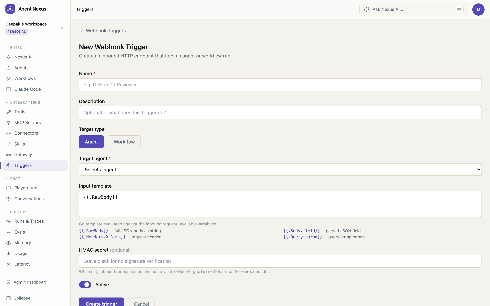

</td>
</tr>
<tr>
<td width="50%">

**Pre-filled for a Workflow (via URL params)**


</td>
<td width="50%">

**Edit Trigger**
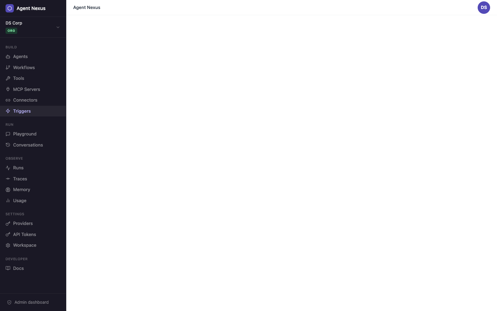

</td>
</tr>
<tr>
<td width="50%">

**Workflow Studio — Triggers Panel**


</td>
<td width="50%">

**Nexus AI — Webhook Trigger Template**
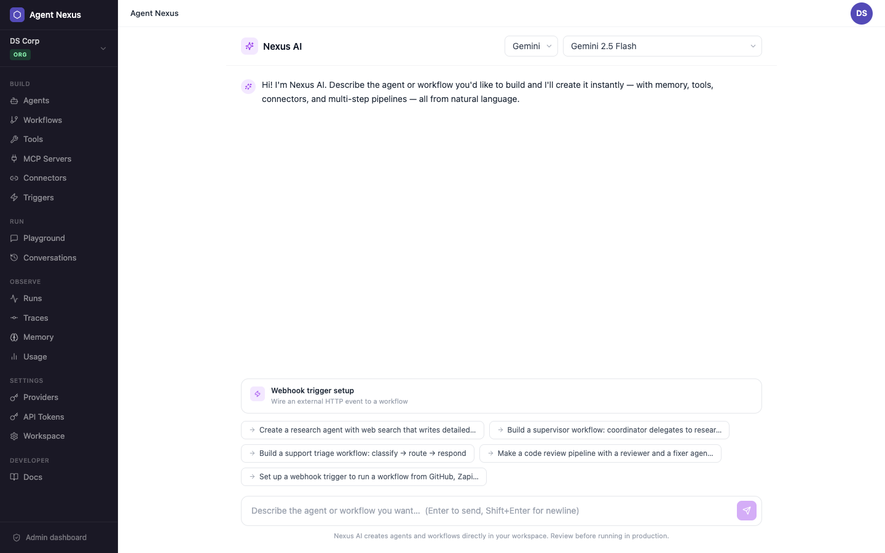

</td>
</tr>
</table>

---

### Admin Portal

<table>
<tr>
<td width="50%">

**Admin Overview**
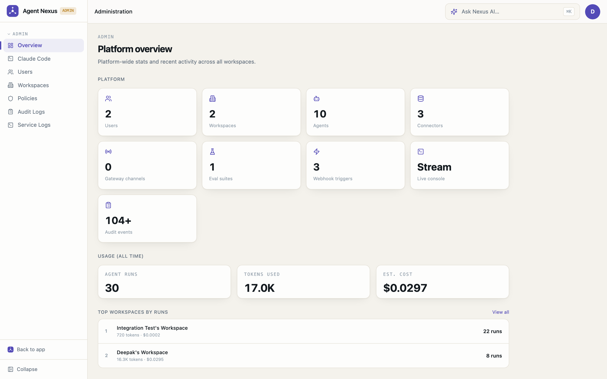

</td>
<td width="50%">

**User Management**
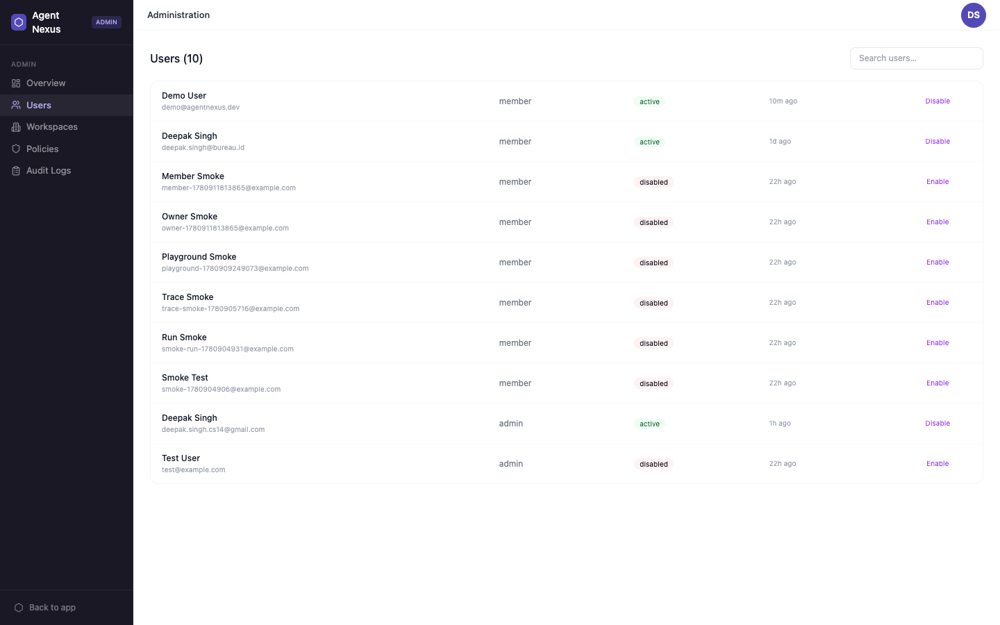

</td>
</tr>
<tr>
<td width="50%">

**Workspace Management**
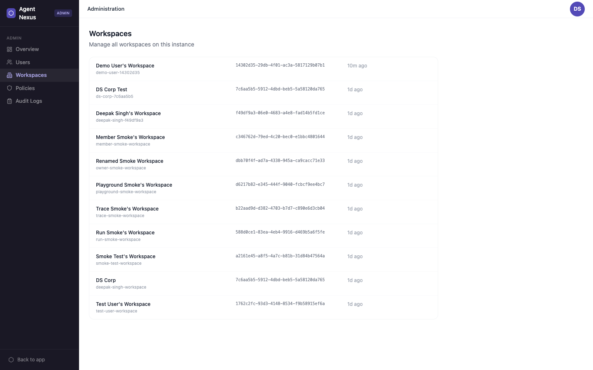

</td>
<td width="50%">

**Audit Logs**
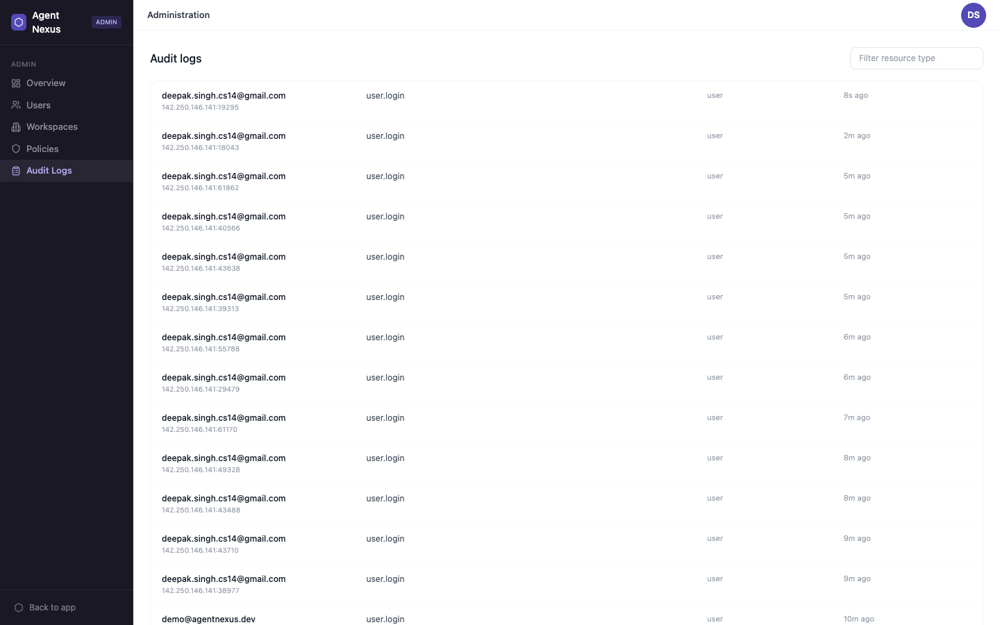

</td>
</tr>
<tr>
<td width="50%">

**Policies**
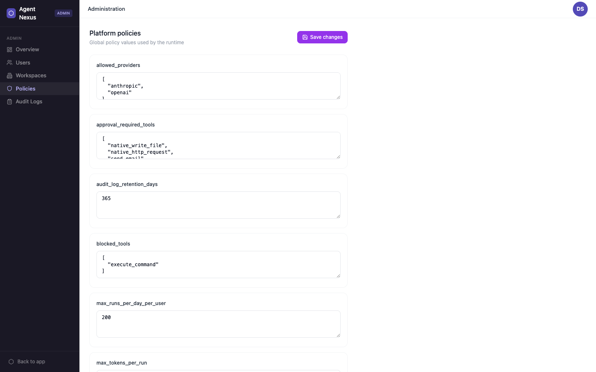

</td>
<td width="50%"></td>
</tr>
</table>

### Built-in Documentation

<table>
<tr>
<td width="50%">

**What is an Agent?**
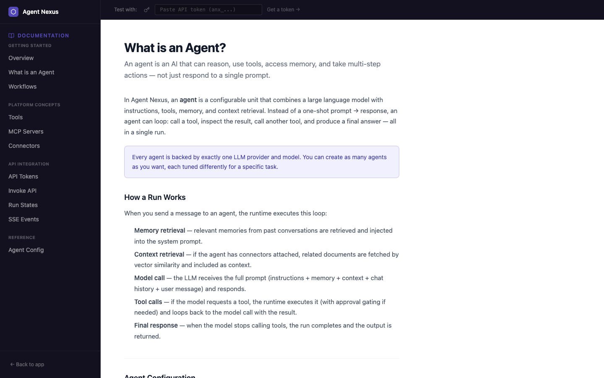

</td>
<td width="50%">

**Agent Configuration Reference**
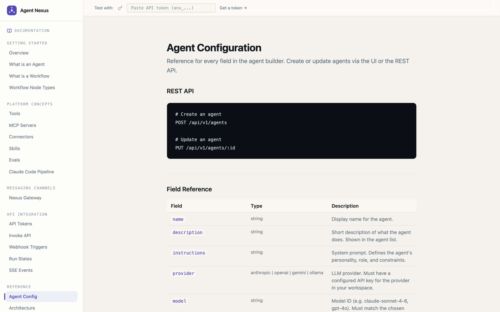

</td>
</tr>
<tr>
<td width="50%">

**Invoke API**
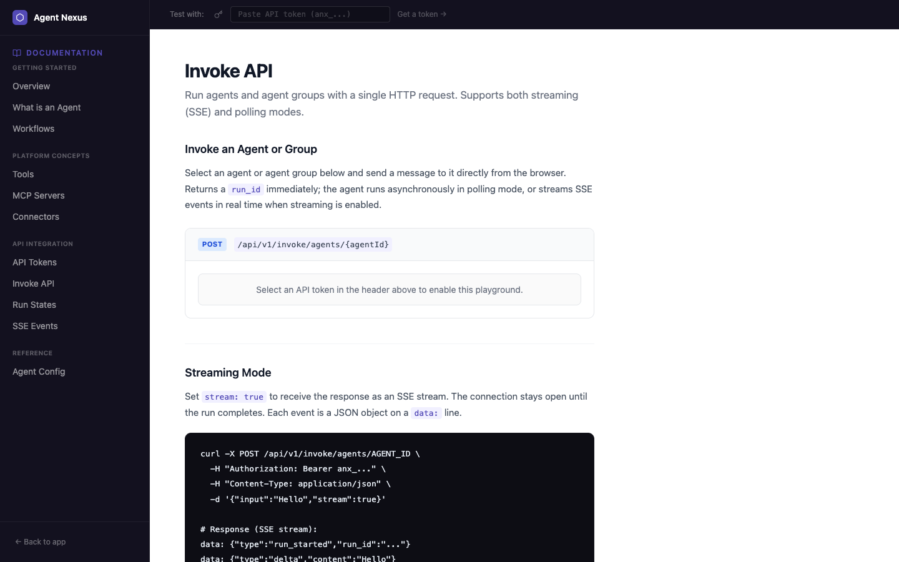

</td>
<td width="50%">

**SSE Stream Events**
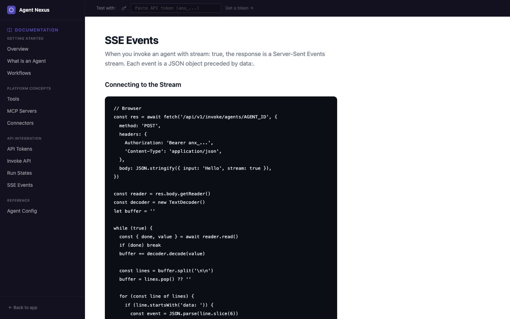

</td>
</tr>
<tr>
<td width="50%">

**MCP Servers Guide**
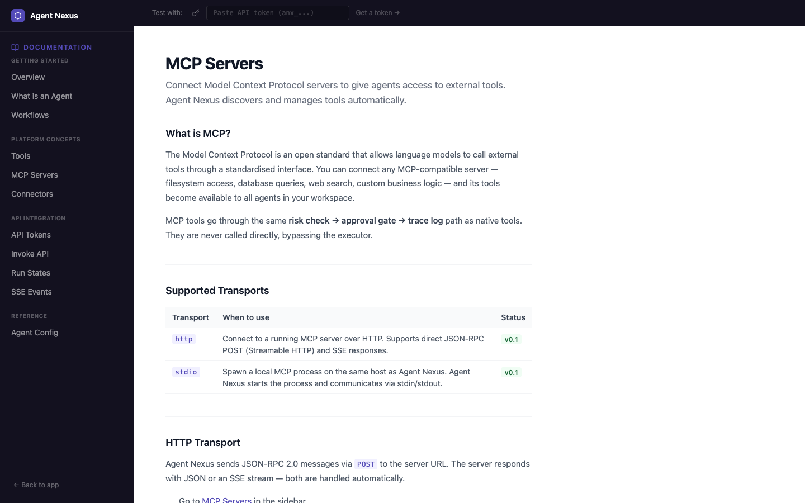

</td>
<td width="50%">

**Workflow Patterns**
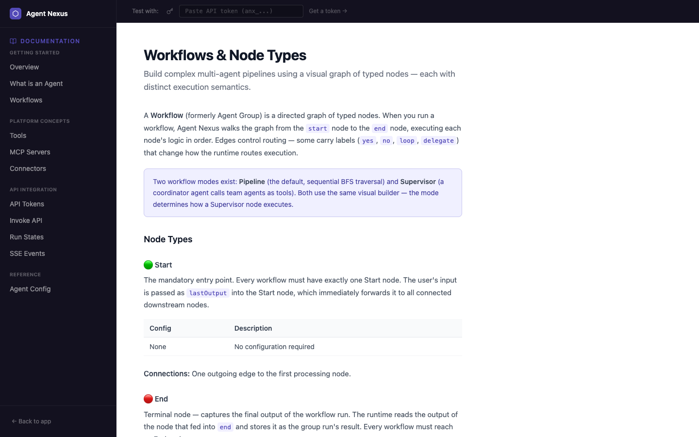

</td>
</tr>
</table>
